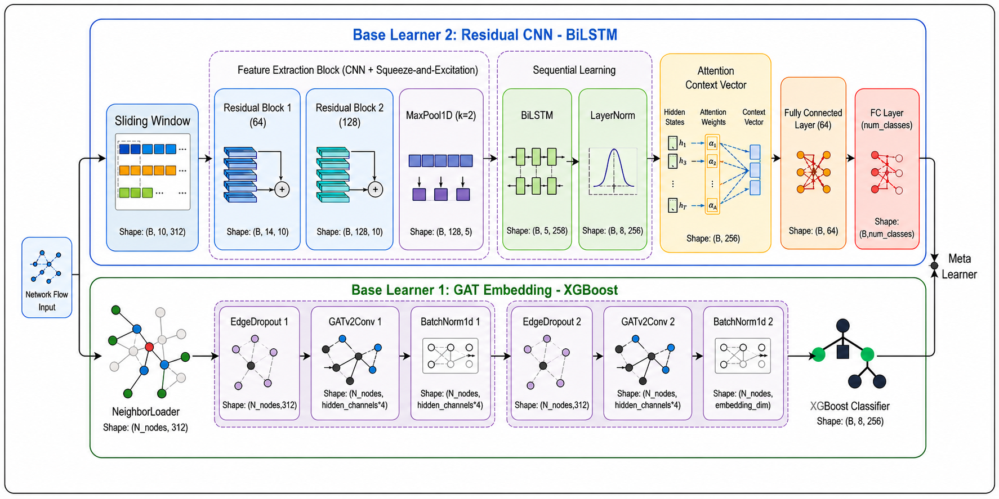

# End-to-End Ensemble Learning for IoT/IIoT Intrusion Detection

This repository contains the source code, experimental notebooks, trained models, and deployment pipeline for **multi-class network intrusion classification in IoT and IIoT environments**.

The proposed approach combines two complementary views of network traffic:

- **Spatial:** represents each network flow as a node, learns embeddings with a Graph Attention Network (GAT), and performs classification with XGBoost.
- **Temporal:** transforms chronologically ordered traffic into sliding windows and classifies them using a Residual CNN–BiLSTM–Attention model.
- **Ensemble:** uses a meta-learner to combine the probability distributions produced by the two branches and generate the final prediction.



## Repository Structure

```text
Graduation Thesis/
├── data_exploration/                         # Data exploration and visualization
├── preprocess_script/                        # Preprocessing for the three use cases
├── Use case 1_HTTP_based_IOT_ZWave_2025/     # HTTP-based DDoS
├── Use case 2_Application_based_IOT_ZWave_2025/
│                                               # Application-based DDoS
├── Use case 3_CIC_IIOT_2025/                 # CIC IIoT 2025
├── docker_deployment/                        # Streaming and inference pipeline
├── Images/                                   # Architecture figures and charts
├── Paper + Report + Slide/                   # Paper and thesis report
└── ref/                                      # Reference papers
```

## Datasets and Use Cases

| Use case | Dataset | Description | Train/validation/test ratio |
|---|---|---|---|
| 1 | IoT-IDS-ZWave-2025 | HTTP-based DDoS | 65/15/20 |
| 2 | IoT-IDS-ZWave-2025 | Application-based DDoS | 30/40/30 |
| 3 | CIC IIoT 2025 | IIoT traffic containing benign traffic and seven attack categories | 70/15/15 |

The data is chronologically ordered before splitting. A hybrid stratified and time-based strategy is used to preserve class distributions while reducing temporal information leakage.

Preprocessed data is stored as Parquet or CSV files inside each use-case directory. Raw datasets are not included in this repository.

## Proposed Architecture

### 1. GAT Embedding–XGBoost

Each network flow is represented as a node in a graph. Directed edges are created only from historical flows to the current flow when they satisfy the temporal constraint and share endpoint information. This graph construction strategy preserves causality and prevents temporal leakage.

The GAT learns a spatial representation for each flow. The resulting embedding—either alone or concatenated with the original features—is passed to XGBoost for classification.

### 2. Residual CNN–BiLSTM–Attention

Network traffic is chronologically ordered and transformed into sliding windows. This branch consists of:

1. Residual 1D-CNN blocks for extracting local patterns.
2. Squeeze-and-Excitation blocks for feature recalibration.
3. BiLSTM layers for learning long-range dependencies.
4. An attention mechanism for aggregating the most relevant time steps.

### 3. Meta-Learner

The probability distributions generated by the two base learners are concatenated and passed to either Logistic Regression or XGBoost. The meta-learner combines spatial and temporal evidence to improve prediction robustness.

## Experimental Organization

The notebooks in each use case are organized into the following groups:

| File group | Purpose |
|---|---|
| `baseline_exper_*.ipynb` | Evaluate conventional machine-learning baselines |
| `baseline_exper_auc_roc.ipynb` | Calculate and visualize AUC-ROC |
| `gat_xgboost_exper_*.ipynb` | Train and evaluate GAT–XGBoost |
| `residual_lstm_exper_*.ipynb` | Train Residual CNN–BiLSTM–Attention |
| `residual_lstm_abalation_*.ipynb` | Conduct ablation studies on residual blocks, sliding windows, and attention |
| `meta_learner*.ipynb` | Combine the outputs of the two base learners |
| `SOTA/` or `sota/` | Compare against DynamicIDS, E-GraphSAGE, xIDS, and tree-based ensembles |
| `model_saved/` | Store PyTorch weights, XGBoost models, and meta-learners |

`exper_1`, `exper_2`, and `exper_3` are **three independent experimental runs**. Their results are used to report the mean and standard deviation in the form `mean ± std`.

The primary evaluation metrics are macro precision, macro recall, macro F1-score, and multi-class AUC-ROC. Macro-averaged metrics are emphasized because the datasets are imbalanced and performance on minority attack classes is particularly important.

## Data Preprocessing

The main preprocessing notebooks are located in `preprocess_script/`:

- `http_based_preprocess.ipynb`: preprocesses use case 1.
- `tcp_based_preprocess.ipynb`: preprocesses use case 2.
- `cciot_preprocessed.ipynb`: preprocesses CIC IIoT 2025 for experimentation.
- `cciot_preprocessed_deployment.ipynb`: creates the data and preprocessing artifacts used by the deployment pipeline.

The preprocessing pipeline handles missing values, categorical and multi-label features, label encoding, and numerical feature normalization with `QuantileTransformer`. The encoders, column definitions, and scaler for use case 3 are stored in:

```text
Use case 3_CIC_IIOT_2025/saved_preprocessed/
```

## Running the Experimental Notebooks

Python 3.11 or 3.12 and a dedicated virtual environment are recommended.

```powershell
python -m venv .venv
.\.venv\Scripts\Activate.ps1
python -m pip install --upgrade pip
python -m pip install -r requirements.txt
```

The main dependencies include:

- PyTorch and PyTorch Geometric
- XGBoost, LightGBM, CatBoost, and scikit-learn
- pandas, NumPy, PyArrow, and joblib
- matplotlib and seaborn
- Jupyter Notebook or JupyterLab

After installing the dependencies, run the notebooks in the following order where applicable:

1. Preprocess the data.
2. Train and evaluate the baseline models.
3. Train GAT–XGBoost.
4. Train Residual CNN–BiLSTM–Attention.
5. Run the meta-learner and SOTA comparison notebooks.

Some notebooks were developed with absolute local paths. Update the data and model path variables near the beginning of each notebook before running them in another environment.

## Deployment Pipeline

The deployment pipeline currently targets **use case 3—CIC IIoT 2025**.


The Docker stack consists of Zookeeper, Kafka, Spark Streaming, the inference daemon, InfluxDB, Grafana, and the Grafana Image Renderer.

### Deployment Models

The primary deployment artifacts are loaded from `Use case 3_CIC_IIOT_2025/model_saved/`:

```text
gat_embedder_exper_1_best.pth
cnn_bilstm_exper_1_best.pth
GAT_XGB_Hybrid_Temporal_Model_exper_1_best.json
meta_learner_xgb_hybrid.json
```

The meta-learner is stored only for use case 3 because this is the use case selected for Docker deployment.


### Starting the System

After updating the paths and reviewing `docker_deployment/.env`:

```powershell
cd docker_deployment
docker compose up -d --build
docker ps
```

Run the data generator on the host machine:

```powershell
$env:DATA_PATH="..\Use case 3_CIC_IIOT_2025\saved_preprocessed\data_1s.parquet"
python data_generator.py
```

Monitor the service logs:

```powershell
docker compose logs -f spark-streaming
docker compose logs -f inference-daemon
```

Default web interfaces:

- Grafana: <http://localhost:3000>
- InfluxDB: <http://localhost:8086>

The Flux queries used to build the dashboard are available in `docker_deployment/grafana_code.md`. More detailed Docker instructions are provided in `docker_deployment/README_DOCKER.md`.

## Documentation

- Thesis report: `Paper + Report + Slide/Graduation Thesis.pdf`
- Paper manuscript: `Paper + Report + Slide/Paper.pdf`
- Architecture figures and data-distribution charts: `Images/`
- Related work and baseline references: `ref/`


## Reproducibility Notes

- The datasets and trained models are large; check the available disk space before running the experiments.
- Preserve the chronological order of flows in both graph-based and sequence-based models.
- Fit scalers and encoders only on the training set to prevent data leakage.
- Use all three independent runs when aggregating experimental results.
- Do not change the meta-learner input order: GAT–XGBoost probabilities must precede CNN–BiLSTM probabilities.

## Author

Graduation thesis conducted at the **School of Information and Communications Technology, Hanoi University of Science and Technology**.
